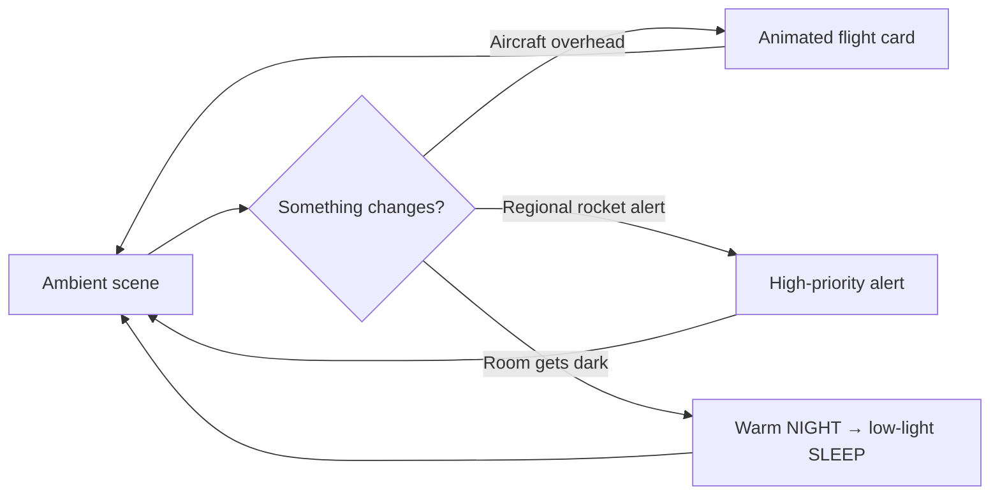

<p align="center">
  
</p>

<p align="center">
  <a href="https://github.com/yinon-mitin/flight-above-head/actions/workflows/build.yml"></a>
  
  
  
  <a href="LICENSE"></a>
</p>

<p align="center"><strong>A decorative LED object that spends its day as art — then becomes a live aircraft and alert display when the sky changes.</strong></p>

Most of the time, Flight Above Head is simply a beautiful part of a room: a
radar sweep, a slow lava lamp, a wave that follows daylight, stars, clocks, or
a calm forecast. When a flight passes overhead, an animated aircraft card takes
the panel. When a regional rocket alert is active, it takes priority over
everything.

<p align="center"><a href="docs/experience-guide.md"><strong>Explore what the panel can do →</strong></a></p>

> Flight Above Head is an informational display, not a certified emergency-warning device. Keep independent official alert channels available.

## Why build one?

| It feels like | It actually does |
| --- | --- |
| A changing piece of interior art | Choose from fourteen ambient scenes: radar, fire, wave, lava, clocks, stars, geometry, weather, and more. |
| A screen that notices the room | Uses daylight, sunset, and optional ambient-light sensing to shift through DAY, NIGHT, and near-dark SLEEP behavior. |
| A live window onto the sky | Transitions into a current overhead-aircraft view and keeps the latest aircraft available afterward. |
| A quietly capable appliance | Handles regional rocket alerts, automatic brightness, retained data during short outages, reset recovery, and diagnostics. |
| A project worth making your own | Open under Apache-2.0, with safe configuration templates and a reproducible secret-free CI build. |

## The experience



The firmware keeps the magic simple at the surface: the panel owns the room,
not a dashboard. Details of the effects, screen priority, automatic modes,
controls, and continuous-operation design are in the [experience guide](docs/experience-guide.md).

## Build yours

### What you need

- ESP32-S3 with OPI PSRAM (the reference board is an ESP32-S3-N16R8 / HW-678);
- 128×64 HUB75E panel and an appropriately sized fused 5 V supply;
- TTP223-style touch module; optional BH1750 ambient-light sensor;
- Arduino IDE 2.x or Arduino CLI.

The complete shopping, wiring, power, and safety detail is in the [hardware guide](docs/hardware-pinout.md).

### Give it a home

```bash
git clone https://github.com/yinon-mitin/flight-above-head.git FlightAboveHead
cd FlightAboveHead

cp secrets.example.h secrets.h
cp location.example.h location.h
```

Fill in Wi-Fi and installation coordinates only in those copied files. They are
ignored by Git. A build without `location.h` is valid, but leaves weather and
solar features disabled.

### Make it light up

1. Open `FlightAboveHead.ino` in Arduino IDE, or follow the [canonical build and deploy guide](docs/build-and-deploy.md).
2. Select **ESP32S3 Dev Module**, OPI PSRAM, and Hardware CDC/JTAG USB mode.
3. Upload, power the panel safely, then press the touch button once.
4. Let it run. Pick a scene with a short touch; ask for `help` over USB Serial whenever you want to explore further.

The first touch deliberately arms the panel after a true cold boot. From then
on it looks after its own day/night behavior and recovers the armed panel after
software, watchdog, brownout, and reset-button restarts.

## Go deeper when you want to

- [What the panel can do](docs/experience-guide.md) — all scenes, live screens, controls, automatic modes, and 24/7 design.
- [Build and deploy](docs/build-and-deploy.md) — exact Arduino IDE and Arduino CLI recipe.
- [Hardware pinout and electrical safety](docs/hardware-pinout.md) — exact GPIO map, power, color order, and panel wiring.
- [Runtime architecture](docs/runtime-architecture.md) — render pipeline, transitions, resilience, and diagnostics.
- [Troubleshooting](docs/troubleshooting.md) — upload, PSRAM, flicker, touch, Wi-Fi, and reset recovery.
- [Release checklist](docs/release-checklist.md) — privacy, validation, soak-test, and publishing checks.

## Make it your own

Flight Above Head is a fast starting point for your own ambient display, local
sky project, or living-space information object. Fork it, reshape the visuals,
adapt the data sources, and share what you build.

The project is licensed under [Apache License 2.0](LICENSE). When redistributing
the work or a derivative, retain the attribution in [NOTICE](NOTICE), which
credits [Yinon Mitin](https://github.com/yinon-mitin) and links to the original
[Flight Above Head project](https://github.com/yinon-mitin/flight-above-head).

For contribution and responsible disclosure guidance, see [CONTRIBUTING.md](CONTRIBUTING.md) and [SECURITY.md](SECURITY.md).
