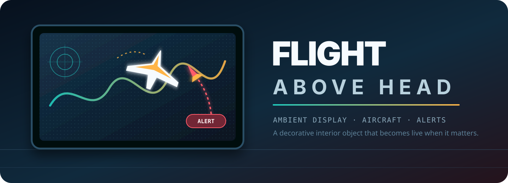
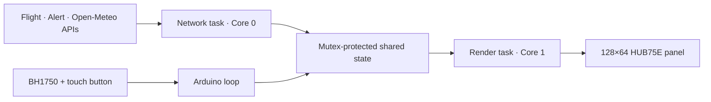

<p align="center">
  
</p>

<p align="center">
  <a href="https://github.com/yinon-mitin/flight-above-head/actions/workflows/build.yml"></a>
  
  
  
  <a href="LICENSE"></a>
</p>

<p align="center"><strong>A decorative interior display with ambient scenes, live overhead aircraft, Israeli rocket alerts, weather, and time on a 128×64 HUB75E panel.</strong></p>

Flight Above Head is an ESP32-S3 firmware project for a fixed installation. Most of the time it behaves as a calm ambient object with changeable screensavers; when an aircraft or regional rocket alert appears, the live signal takes priority. Private Wi-Fi credentials and coordinates stay outside Git.

> This is a safety-adjacent information display, not a certified emergency-warning device. Do not rely on it as the sole source of civil-defense or aviation information.

## Highlights

| Capability | Behavior |
| --- | --- |
| Live airspace | Polls the configured AirPlaneTracker service and prioritizes a current aircraft card. |
| Israeli rocket alerts | Regional alert state always overrides aircraft and selected UI screens. |
| Ambient display | Includes time, weather, forecast, daylight-aware themes, fourteen screensavers, and BH1750 brightness control. |
| Resilience | Retains last-good data, bounded retries, diagnostics, reset recovery, and a blank cold-start panel. |
| Privacy boundary | Real `secrets.h` and `location.h` are ignored; tracked `.example` templates document the required format. |
| Repeatable CI | GitHub Actions compiles a secret-free ESP32-S3 build on every push and pull request. |

## Architecture



Detailed task ownership, render cadence, failure handling, and state priority: [runtime architecture](docs/runtime-architecture.md).

## Quick start

### 1. Hardware and software

The reference build targets an **ESP32-S3-N16R8 / HW-678** with OPI PSRAM, a 128×64 HUB75E panel, a TTP223-style touch module, and an optional BH1750 light sensor.

Install:

- Arduino IDE 2.x or Arduino CLI;
- Espressif Arduino-ESP32 core `3.3.11`;
- `ESP32 HUB75 LED MATRIX PANEL DMA Display@3.0.14`;
- `ArduinoJson@7.4.3`;
- `Adafruit GFX Library@1.12.6`.

See the complete [pinout and power guidance](docs/hardware-pinout.md) before connecting a panel.

### 2. Add local configuration

```bash
cp secrets.example.h secrets.h
cp location.example.h location.h
```

Edit only the copied files. They are ignored by Git:

```cpp
// secrets.h
constexpr const char *WIFI_SSID = "your-wifi-ssid";
constexpr const char *WIFI_PASSWORD = "your-wifi-password";

// location.h
#define HOME_LATITUDE 00.000000
#define HOME_LONGITUDE 00.000000
```

A build without `location.h` is valid for CI but intentionally disables weather and solar polling. Never commit either local file.

### 3. Build

Arduino CLI:

```bash
arduino-cli core install esp32:esp32@3.3.11
arduino-cli lib install "ESP32 HUB75 LED MATRIX PANEL DMA Display@3.0.14"
arduino-cli lib install "ArduinoJson@7.4.3"
arduino-cli lib install "Adafruit GFX Library@1.12.6"

# Arduino requires its sketch directory to match FlightAboveHead.ino.
# Clone or place the repository in a directory named FlightAboveHead.
arduino-cli compile \
  --fqbn 'esp32:esp32:esp32s3:FlashSize=16M,PSRAM=opi,PartitionScheme=app3M_fat9M_16MB,USBMode=hwcdc,CDCOnBoot=cdc' \
  /path/to/FlightAboveHead
```

For Arduino IDE settings, USB upload recovery, and the full deployment sequence, see [troubleshooting](docs/troubleshooting.md) and [hardware pinout](docs/hardware-pinout.md).

### 4. First boot

1. Power the controller and panel with a stable supply and common ground.
2. The firmware starts network, time, APIs, sensor, and touch input while leaving HUB75 electrically blank.
3. Press the touch button once, or send `panel on`, to initialize the display. That first touch is intentionally consumed.
4. Open Serial Monitor at `115200` baud and confirm `[display] ready`, Wi-Fi, NTP, and the expected GPIO map.

## Operate it

| Gesture / command | Result |
| --- | --- |
| First touch after a cold power-on | Initializes the HUB75 display. |
| Short touch | Enters or advances screensavers. |
| Double touch | Opens/closes Last Aircraft; acknowledges the currently visible live aircraft. |
| Long touch | Toggles automatic BH1750 brightness and manual brightness. |
| `panel on` / `panel off` | Enables or blanks the panel without stopping background services. |
| `brightness auto \| fixed \| 0..255` | Selects sensor, default, or exact brightness. |
| `screen auto \| idle \| last \| aircraft \| test \| saver \| alert` | Selects a test screen; alert and live-aircraft priority remains enforced. |
| `saver next \| saver 1..14` | Changes the active screensaver. |
| `night auto \| night on \| night off` | Selects automatic or forced visual mode. |
| `diag` / `status` | Prints a structured runtime snapshot. |

## Repository map

```text
FlightAboveHead.ino          Firmware entry point
api_config.h                 Public endpoint and private-location loader
build_opt.h                  ESP32 HUB75 DMA build options
secrets.example.h            Safe Wi-Fi configuration template
location.example.h           Safe location configuration template
open_meteo_ca.h              Pinned CA for authenticated Open-Meteo HTTPS
assets/                      Repository brand assets
docs/                        Architecture, wiring, API notes, troubleshooting
tests/                       Host-side regression checks
.github/workflows/build.yml  Secret-free ESP32-S3 CI compile
NOTICE                       Required attribution notice for redistributions
```

## Documentation

- [Hardware pinout and electrical safety](docs/hardware-pinout.md)
- [Runtime architecture](docs/runtime-architecture.md)
- [API observations](docs/api-observations.md)
- [Troubleshooting](docs/troubleshooting.md)
- [Release checklist](docs/release-checklist.md)
- [Changelog](CHANGELOG.md)
- [Contributing](CONTRIBUTING.md)
- [Security policy](SECURITY.md)

## Security and privacy

- Keep `secrets.h` and `location.h` local and untracked.
- Review Serial logs and photos before sharing: SSIDs, infrastructure URLs, and image metadata can disclose private information.
- The Open-Meteo request uses HTTPS with certificate verification for the location-bearing call.
- Before release, run the checks in [docs/release-checklist.md](docs/release-checklist.md).

To report a potential vulnerability privately, follow [SECURITY.md](SECURITY.md). Do not publish credentials or a secret in an issue.

## Contributing

Issues and pull requests are welcome. Start with [CONTRIBUTING.md](CONTRIBUTING.md), keep the secret-free build green, and never add local configuration files to a commit.

## License

This project is licensed under [Apache License 2.0](LICENSE): you may use,
modify, and redistribute it, including as a starting point for another project.
When redistributing the work or a derivative, retain the attribution notice in
[NOTICE](NOTICE), which credits [Yinon Mitin](https://github.com/yinon-mitin)
and links to the original [Flight Above Head project](https://github.com/yinon-mitin/flight-above-head).

The project is provided without warranty. Third-party dependencies and services
retain their own licenses and terms.

## Third-party software and services

This project uses [Espressif Arduino-ESP32](https://github.com/espressif/arduino-esp32), [ESP32-HUB75-MatrixPanel-DMA](https://github.com/mrcodetastic/ESP32-HUB75-MatrixPanel-DMA), [ArduinoJson](https://github.com/bblanchon/ArduinoJson), [Adafruit GFX](https://github.com/adafruit/Adafruit-GFX-Library), and [Open-Meteo](https://open-meteo.com/). Their licenses and service terms apply independently.
